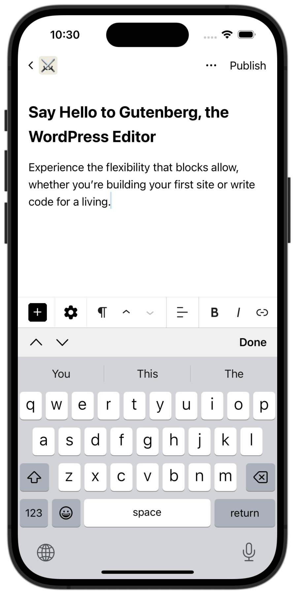
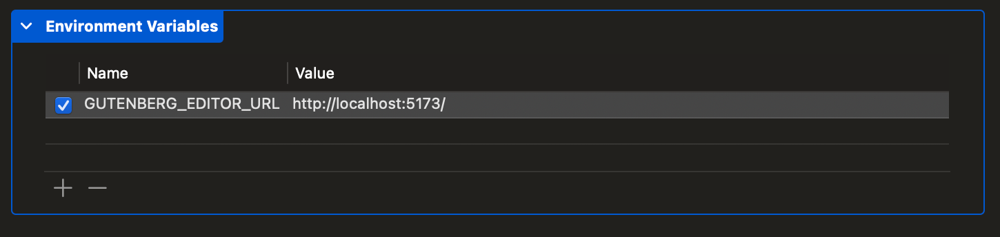

# GutenbergKit

An experimental Gutenberg block editor for native iOS and Android apps relying upon web technologies.



## Development
 
### Preqrequisites

In order to build GutenbergKit, the following tools must be installed on your development machine:

-   [Node.js](https://nodejs.org/en/download/) - Required for building the web app; recommend using [Node Version Manager](https://github.com/nvm-sh/nvm).
-   [Xcode](https://developer.apple.com/xcode/) - Required if building iOS demo app.
-   [Android Studio](https://developer.android.com/studio) - Required if building Android demo app.

### Compatibility Matrix
| Feature                   | WordPress Core (no plugins) | WordPress.com              | Self Hosted + Gutenberg Plugin | Self Hosted + Jetpack Plugin| Self Hosted + Jetpack + Gutenberg |
|-------------------------- |---------------------------- |--------------------------- |--------------------------------|-----------------------------|-----------------------------------|
| Post Editing              | ✅ Supported                | ✅ Supported               | ✅ Supported                   | ✅ Supported                | ✅ Supported                      |
| Native Block Inserter [3] | ✅ Supported                | ✅ Supported               | ✅ Supported                   | 🔴 Not Supported            | ✅ Supported                      |
| Third-Party Blocks    [5] | 🔴 Not Supported            | ⚠️ Only Jetpack Blocks [2] | 🔴 Not Supported               | ⚠️ Limited Support      [4] | ⚠️ Limited Support            [4] |
| Theme Styles          [6] | 🔴 Not Supported            | ✅ Supported               | ✅ Supported                   | 🔴 Not Supported            | ✅ Supported                      |

[1] Works for sites that don't support third-party blocks or theme styles.
[2] Currently, only Jetpack blocks are supported on WordPress.com.
[3] Requires the following Gutenberg private APIs:
- `useInsertionPoint`
- `useBlockTypesState`

[4] The Jetpack plugin has been updated to ensure its blocks are supported. Most third-party blocks should work if they follow common conventions.
[5] Requires Block Asset REST API [link to GH issue / trac ticket]()
[6] Requires Theme Style enumeration API [link to GH issue / trac ticket]()

### Web App

Install the GutenbergKit dependencies and start the development server by running the following command in your terminal:

```bash
make dev-server
```

Once finished, the web app can now be accessed in your browser by visiting the URL logged in your terminal. However, it is recommended to use a native host app for testing the changes made to the editor for a more realistic experience. A demo app is included in the GutenbergKit package, along with instructions on how to use it below.

### Demo App

This demo app is useful for quickly testing changes made to the editor.

#### iOS

The iOS demo app loads the development server by default.

1. Start the development server by running `make dev-server`.
1. Launch Xcode and open the `ios/Demo-iOS/Gutenberg.xcodeproj` project.
1. Select the `Gutenberg` target.
1. Run the app.

Alternatively, you can load a production build of the web app bundled with the GutenbergKit package by running `make build` and disabling the `GUTENBERG_EDITOR_URL` environment variable by navigating to _Product_ → _Scheme_ → _Edit Scheme_ in Xcode.

<details>
<summary>Example Xcode environment variable</summary>



</details>

#### Android

The Android demo app loads the production build of the web app bundled with the GutenbergKit package by default—i.e., the output of the project's `make build` command). It can be configured to load the development server by setting a `GUTENBERG_EDITOR_URL` environment variable in the `android/local.properties` file.

1. Start the development server by running `make dev-server`.
1. Launch Android Studio and open the `android` project.
1. Modify the `android/local.properties` file to include an environment variable named `GUTENBERG_EDITOR_URL` with the development server URL.
1. Run the app on an emulator.

<details>
<summary>Example Android local.properties</summary>

```
GUTENBERG_EDITOR_URL=http://10.0.2.2:5173/
```

</details>

> [!NOTE]
> Android emulators route `http://10.0.2.2` to the host machine's IP address, allowing easy access to the development server from the emulator. For iOS simulators, the localhost URL is `http://localhost`. Appending the correct Vite development server port is required, which Vite logs when starting the server.
>
> To run the demo app on a physical device, see the [physical device setup guide](./docs/physical-device-setup.md).

See the [architecture overview](./docs/architecture.md) for additional details regarding project organization and development tips.

## Testing

Important, high-level test cases are [documented](./docs/test-cases.md) for manual testing guidance. Additionally, automated tests are included in the project to ensure code quality and functionality.

To run the JavaScript tests, run the following command in your terminal:

```bash
make test-js
```

To run the Swift tests, run the following command in your terminal:

```bash
make test-swift
```

To run the Android tests, run the following command in your terminal:

```bash
make test-android
```

## Production

To build GutenbergKit for production run the following command in your terminal:

```bash
make build
```

Once finished, the Swift and Kotlin packages are ready to publish. Consuming iOS or Android host apps can then include the GutenbergKit package as a dependency.

## Releases

See the [release documentation](./docs/releases.md) for more information.
